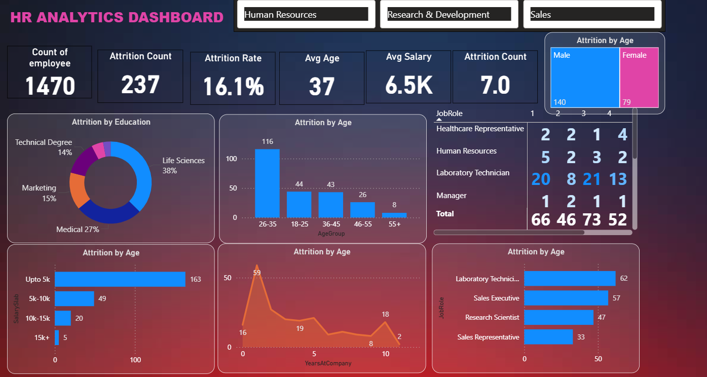

# HR Analytics Dashboard (Power BI)

This project presents an interactive **HR Analytics Dashboard** built in **Microsoft Power BI**.  
The dashboard provides key insights into workforce performance, attrition patterns, recruitment trends, and diversity within the organization — helping HR departments make data-driven decisions.

---

## 🧭 Project Objective

The goal of this dashboard is to transform raw HR data into meaningful analytics and visual insights.  
It helps answer critical HR questions such as:
- Which departments have the highest attrition rates?
- What are the main reasons for employee turnover?
- How is performance distributed across teams?
- What is the gender and age distribution of employees?
- How efficient is the recruitment pipeline?

---

## 📊 Dashboard Overview

The **Overview Page** provides a consolidated snapshot of all HR KPIs, including employee count, attrition rate, average tenure, and department-wise breakdowns.  
Interactive filters allow users to drill down by department, gender, job role, and time period.

---

## 💡 Key Insights

- **Attrition Analysis** — Identified high turnover in specific departments and among certain job roles.  
- **Performance Metrics** — Highlighted top-performing and low-performing areas across divisions.  
- **Recruitment Pipeline** — Measured hiring trends and time-to-fill ratios.  
- **Workforce Diversity** — Evaluated gender balance and representation in different positions.  
- **Tenure Distribution** — Visualized employee experience levels to support retention strategies.

---

## 🗂️ Project Structure

